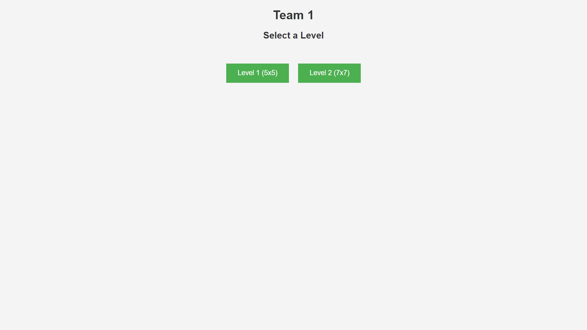
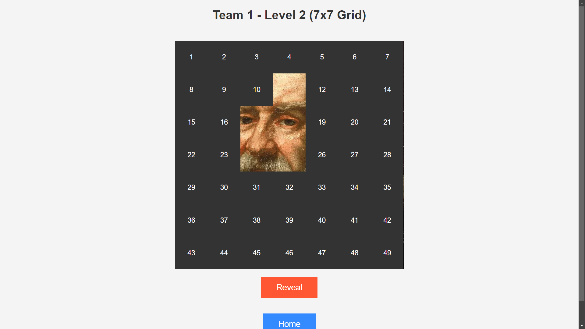
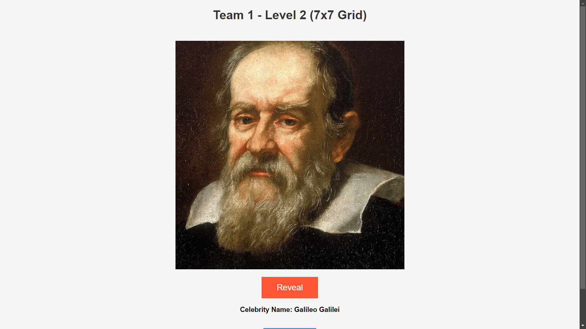

# **Team Matrix Game**  
### *Guess the Hidden Personality!*  

Team Matrix Game is a web-based interactive guessing game, designed to be played by multiple teams. It's built with Flutter and offers an engaging experience where teams compete to identify a hidden personality by revealing as few boxes as possible.

---

## **Features**  

- **Team Selection**:  
  - On the first page, users can select a team number from **Team 1 to Team 6**.  

- **Levels of Play**:  
  - Each team gets **two levels** of gameplay:  
    - **5x5 Matrix**  
    - **7x7 Matrix**  
  - Teams take turns opening boxes in the matrix to reveal parts of a hidden image of a famous personality.  
  - The objective is to guess the personality with the **minimum number of boxes opened**.

- **Preloaded Images**:  
  - Images of famous personalities are preloaded in the app.  
  - You can easily change the images by replacing them in the \`assets\` folder.

- **Level Customization**:  
  - Adding new levels or modifying existing ones is fully supported in the code.

---

## **How to Get Started**  

1. Clone the repository.  
2. Open the project in your preferred Flutter development environment.  
3. Run the app using \`flutter run\` in your terminal.  

---

## **Customization**  

- **Changing Images**:  
  Replace the images in the \`assets\` folder with your own images of famous personalities.  
- **Adding Levels**:  
  Modify the code to add new levels, following the format of existing levels.

---

## **Contribution**  

Feel free to fork the repository, raise issues, or submit pull requests if you'd like to contribute to the project.

---

## **Screenshots**  

  
    
    

  
    

*Figure 1: Team selection screen (left), Figure 2: Gameplay screen (right), Figure 3: Guessing the hidden personality (below)*" > README.md

